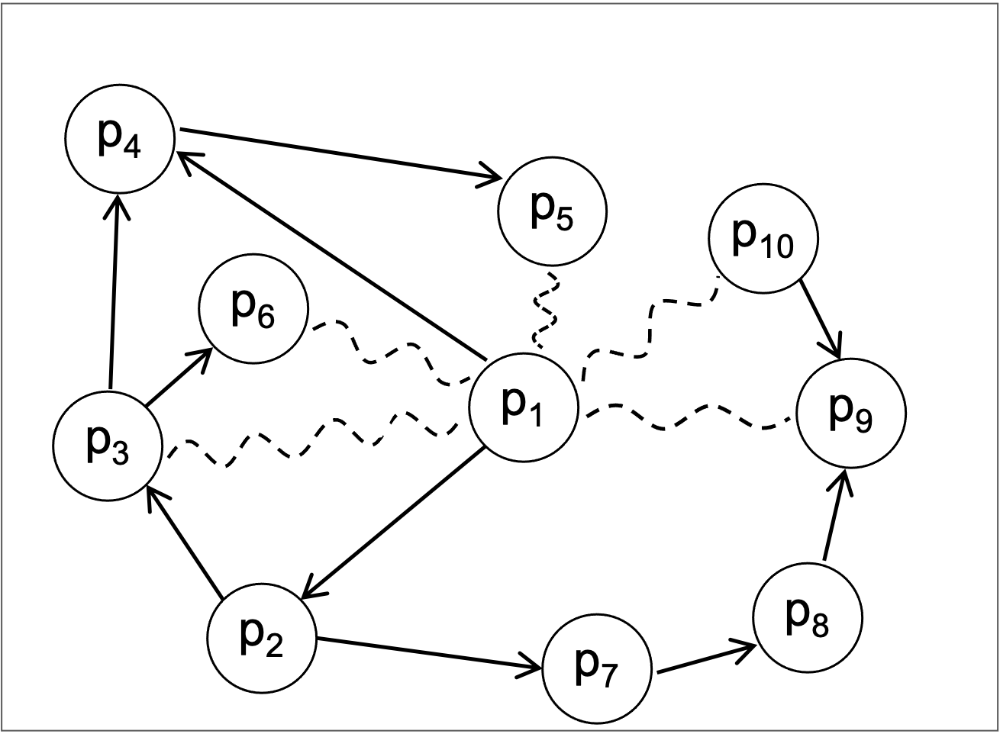
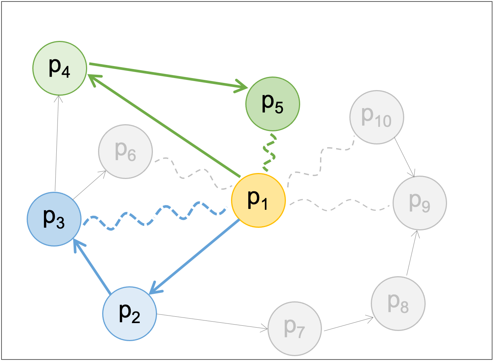
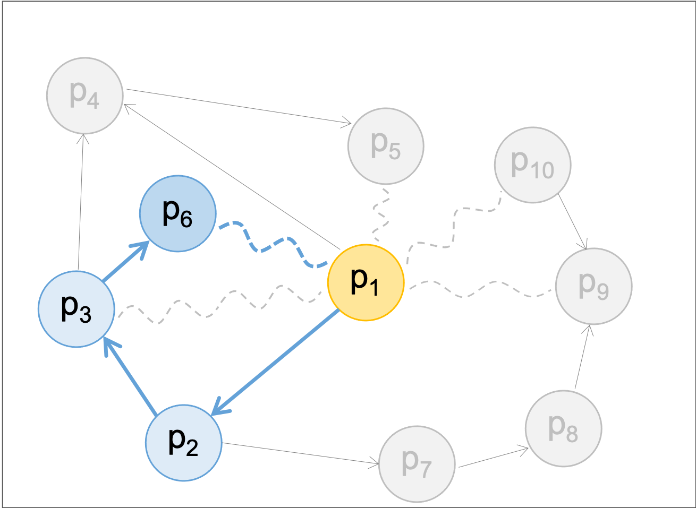
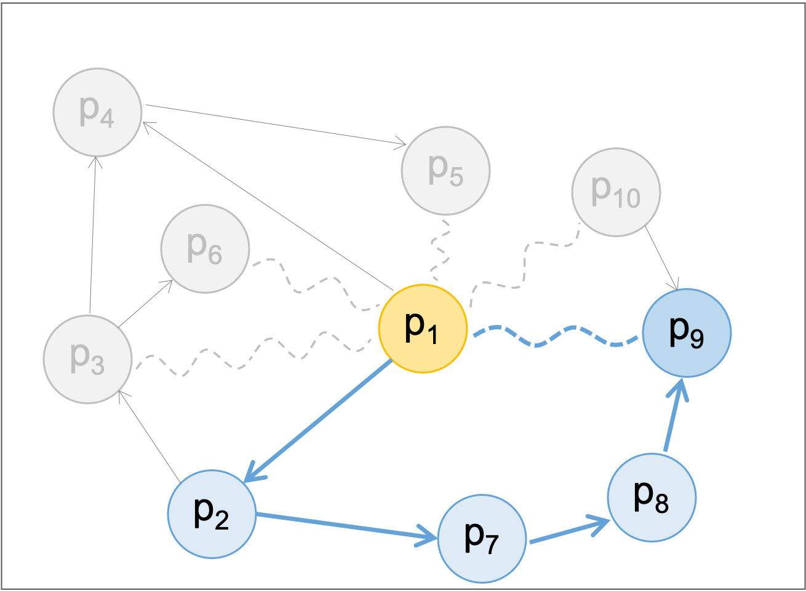

# k_step_PIC
## Installation

`pip install git+https://github.com/lee-ju/k_step_PIC.git`

## Usage

#### Load Package
```python
from k_step_pic import kstep_pic_E
```

#### Example Data
```python
from_cam = ['P1', 'P1', 'P2', 'P2', 'P3', 'P3', 'P4', 'P7', 'P8', 'P10']
to_cam = ['P2', 'P4', 'P3', 'P7', 'P4', 'P6', 'P5', 'P8', 'P9', 'P9']
from_sam = ['P1', 'P1', 'P1', 'P1', 'P1']
to_sam = ['P3', 'P5', 'P6', 'P9', 'P10']
repo = {'P1': 20050101,
        'P2': 20070101,
        'P3': 20100101,
        'P4': 20150101,
        'P5': 20200101,
        'P6': 20150101,
        'P7': 20100101,
        'P8': 20150101,
        'P9': 20200101,
        'P10': 20150101}
```
- `from_cam` and `to_cam` meaning:
    1. `from_cam`: In-node lists of Citation Network.
    2. `to_cam`: Out-node lists of Citation Network.

- `from_sam` and `to_sam` meaning:
    1. `from_sam`: In-node lists of Similarity Network.
    2. `to_sam`: Out-node lists of Similarity Network.

- `repo` meaning:
    1. `repo: Dictionary containing the registration date of each patent.


#### 1step PIC
```python
k = 1
results = kstep_pic_E(from_cam=from_cam, to_cam=to_cam,
                      from_sam=from_sam, to_sam=to_sam,
                      repo=repo, td_max=365*20, k=k)
print("* * 1step-PIC * * \n", results, "\n")
```

```python
[Out]: 
* * 1step-PIC * * 
   P_E P_L
0  P1  P3
1  P1  P5 
```


#### 2step PIC
```python
k = 2
results = kstep_pic_E(from_cam=from_cam, to_cam=to_cam,
                      from_sam=from_sam, to_sam=to_sam,
                      repo=repo, td_max=365*20, k=k)
print("* * 2step-PIC * * \n", results, "\n")
```

```python
[Out]: 
* * 2step-PIC * * 
   P_E P_L
0  P1  P6 
```


#### 3step PIC
```python
k = 3
results = kstep_pic_E(from_cam=from_cam, to_cam=to_cam,
                      from_sam=from_sam, to_sam=to_sam,
                      repo=repo, td_max=365*20, k=k)
print("* * 3step-PIC * * \n", results, "\n")
```

```python
[Out]: 
* * 3step-PIC * * 
   P_E P_L
0  P1  P9 
```
